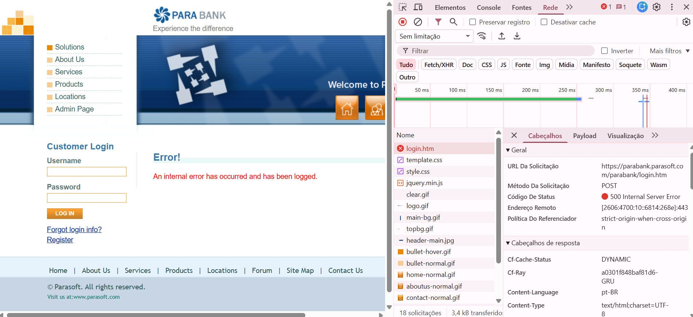

---

## BUG001 — Impedimento Técnico: Instabilidade Crítica no Serviço de Autenticação (Login)

### 1. Cenário e Contexto
Durante a execução e coleta de evidências do módulo de empréstimos, o sistema apresentou uma falha crítica no fluxo de acesso, gerando o travamento completo do ciclo de testes (*Blocker*).

* **URL de Solicitação:** https://parabank.parasoft.com/parabank/index.htm
* **Método HTTP:** POST
* **Código de Status Retornado:** 500 Internal Server Error

---

### 1.1 Steps to Reproduce

1. Acessar a página de login do sistema ParaBank
2. Inserir credenciais válidas (usuário/senha)
3. Clicar em "Log In"
4. Observar falha no processo de autenticação

---

### 2. Comportamento na Interface (UI)
O sistema interrompe a navegação e renderiza a mensagem de erro global:

> "Error! An internal error has occurred and has been logged."

---

### 3. Evidência Técnica (Inspeção via DevTools)
A captura de tela abaixo evidencia a falha no serviço de autenticação, indicando possível problema no backend ou infraestrutura da aplicação:

---

### 4. Impacto
* **Severidade:** Alta
* **Prioridade:** Urgente (Blocker)
* **Status:** Open - Blocker (Environment Issue)

O prosseguimento dos testes funcionais do módulo de empréstimos está condicionado à estabilização deste serviço.

---

## Traceability Matrix

Este bug está relacionado ao fluxo de execução do módulo de empréstimos e impacta indiretamente a validação das regras de negócio.

- **Requirement impacted:** RN01 (execution blocked before validation)
- **Related test cases:** CT001, CT002, CT003, CT004
- **Related improvement:** IMP001 (UX clarity and error message transparency) | IMP002 (Input validation and submission handling)
